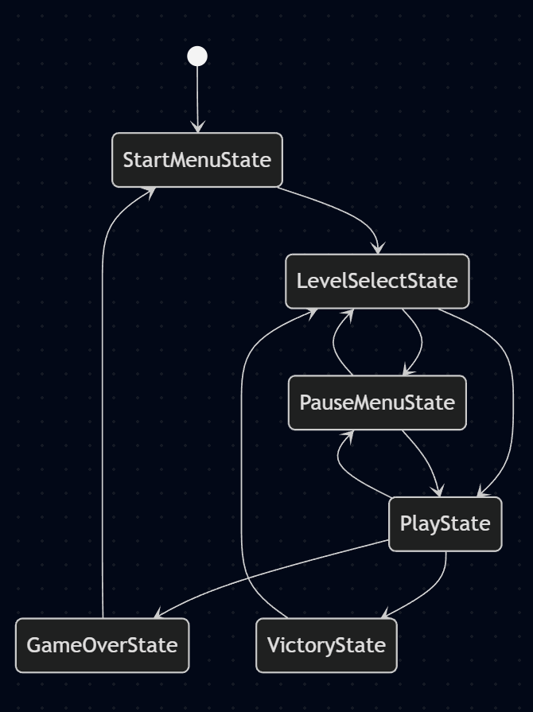
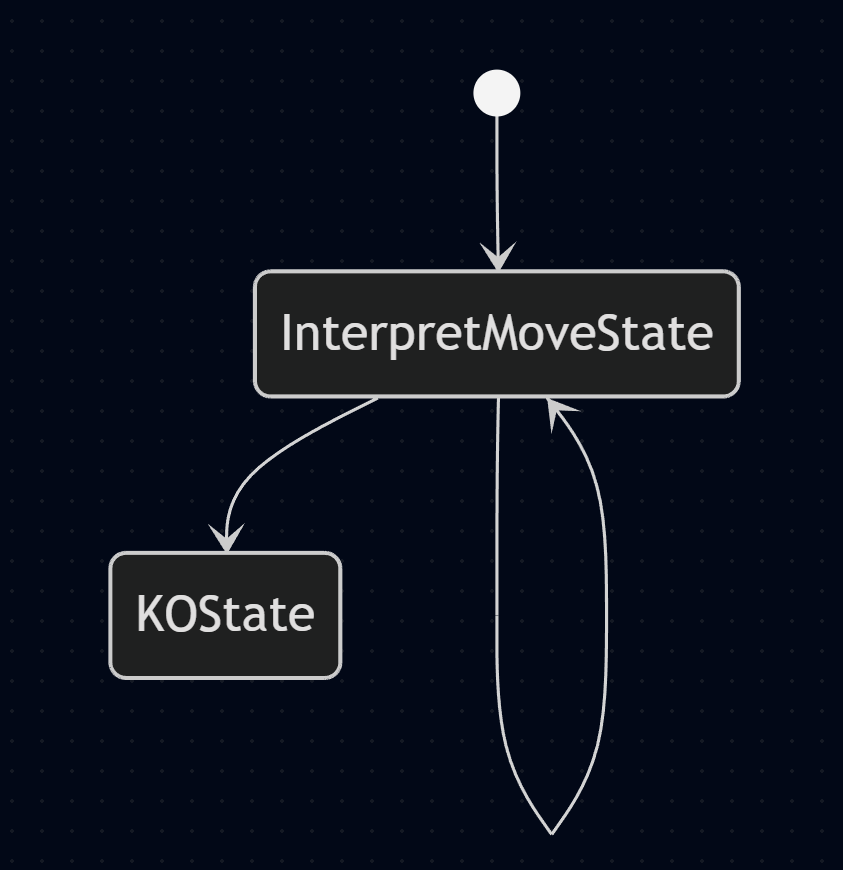
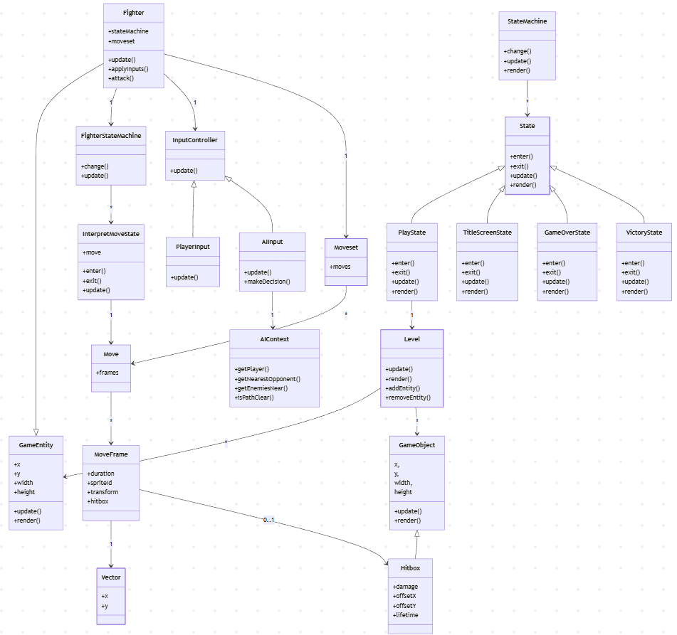
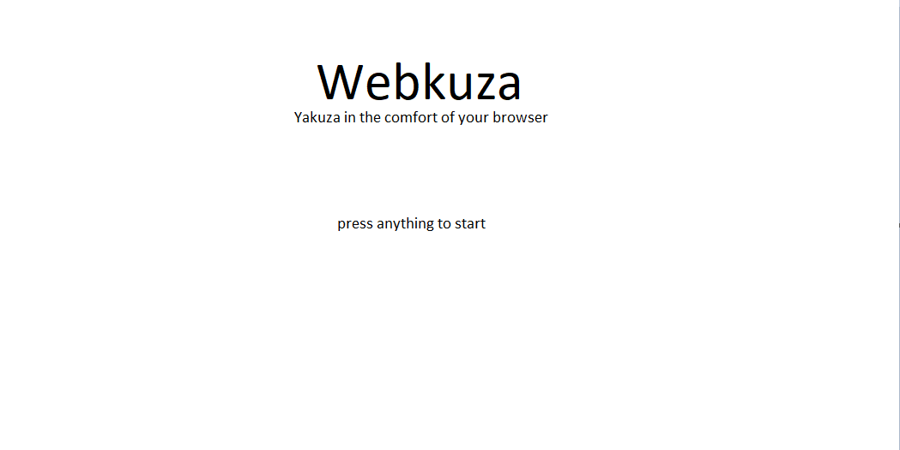
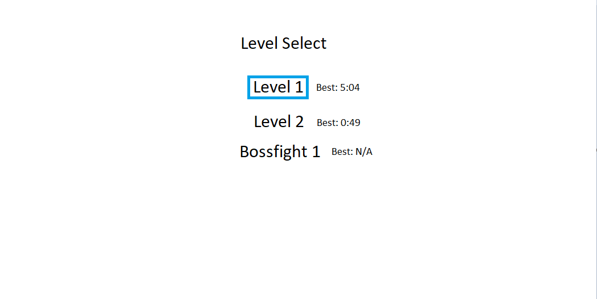

# 2d side scroller beat-em-up

## ✒️ Description

In this side scrolling beat-em-up inspired by the yakuza games, the player starts at the leftmost point in the level and must progress their way forwards by defeating the enemies.

## 🕹️ Gameplay

Players may move forwards(to the right) or backwards (tothe left) when playing a level. The player wins and the level ends whenever the player reaches the rightmost part of the level after having neutralized every enemy. The enemies may also attack the player and they both have a certain amount of health. If health runs out, the fighter is knocked out. If the player is knocked out, it is a game over.

## 📃 Requirements

Must have:
- The game must be a side scroller
- The player can control a character
- The player character can attack
- The player character must at least have one combo
- The player character must at least have one kick
- There must be enemy characters with ai that can attack the player
- The player must move forwards (to the right) while neutralizing the enemies to win.
- Both the player and enemies must have a set amount of health
- There must be at least one boss fight, that being a particularly strong enemy
- The player must have a walk and a dash as movement options
- The game must store how long it took the player to complete each level

Nice have:
- Grapples (synchronized animations) that the players and enemies can do
- Weapons that can be picked up and used by the opponents
- The ability to block attacks for both players and enemies
- More than one bossfight
- Yakuza-themed visuals and audio
- Various animations for reactions to being hit from players and enemies
- Have the player character always face an enemy so that the player can back away from the enemy without turning their back

### 🤖 State Diagram

Here is how my fighter state machine operates. In such a game, there will be many states, which could cause poor scalability and organization when i have to create a new class for each and every move the player and enemies can perform. Also taking in consideration the similar behaviour that all those states would have, it would violate DRY (Do not Repeat Yourself). This is why i opted to have a generic interprate move state.

Here is an example of what a moveset would look like represented as a visual flowchart. This date will be stored as json and interpreted by my generic state interpreter

### 🗺️ Class Diagram

### 🧵 Wireframes

-   Starting will take the player to the level selection screen

The player has a blue selection cursor that moves with the arrow keys or wasd keys. pressing enter will load the level they selected
Next to each level is indicated the players best time, whith N/A if they never completed the level

### 🎨 Assets

Most graphical elements will be ai generated with chatgpt and/or made with photopea.com
microsoft paint was used to generate wireframes
mermaid.live was used to generate state and class diagrams

#### 🖼️ Images

I intend to ai generate most of my pixel art using tools like chatgpt.com and perchance.org

#### ✏️ Fonts

I intend to use the edo sz font as it is the font that is used in the yakuza games
https://www.dafont.com/edo-sz.font

#### 🔊 Sounds

I intend on downloading sounds from youtube to mp3 converters as well as
freesound.org

https://www.youtube.com/watch?v=26oo5Guc6kU
